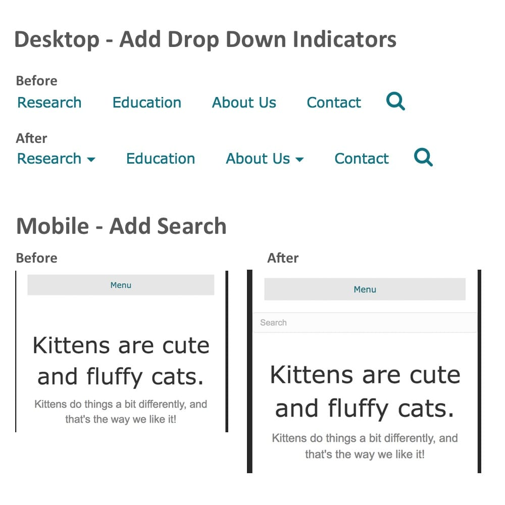

# bbMenuPolish Read Me

This plugin will automatically add drop down indicators to header menus if there are children. It'll also add a search box below the header for mobile devices since BeaverBeaver builder doesn't have search on mobile.

###To Use
1. Download the files.
2. Put them into a `bbMenuPolish` folder if they aren't already.
3. Put the folder into your WordPress plugin directory.
4. Activate the plugin.

That's it. There are no options yet.

[BeaverBuilder](https://www.wpbeaverbuilder.com/?fla=468) is required.

###Preview

Note: I just threw this plugin together. I don't think there are any big issues, but I'm sure there are use cases that I haven't come across yet. Let me know when you come across something.

